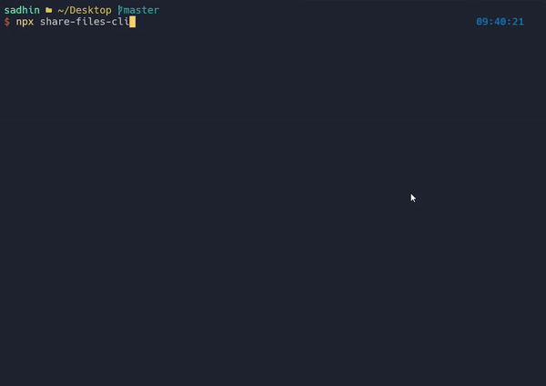

# file-share-cli

File sharing from command line

```bash
npx share-files-cli
```

### Upload:


### Download:


<!-- https://github.com/user-attachments/assets/a140fc49-d914-468c-81f5-33eb23c2ca51 -->
